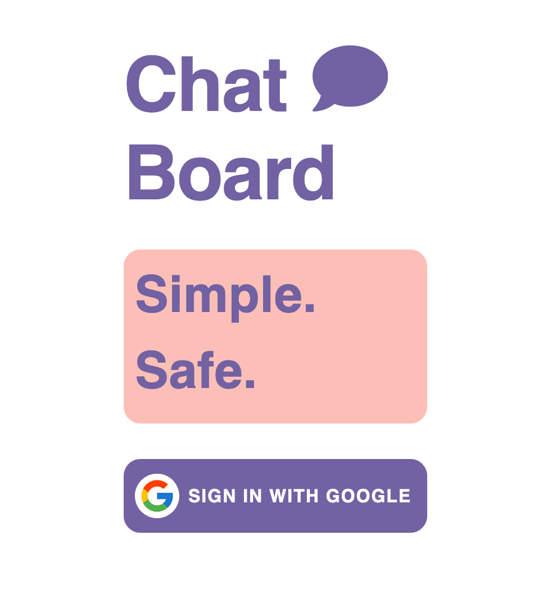
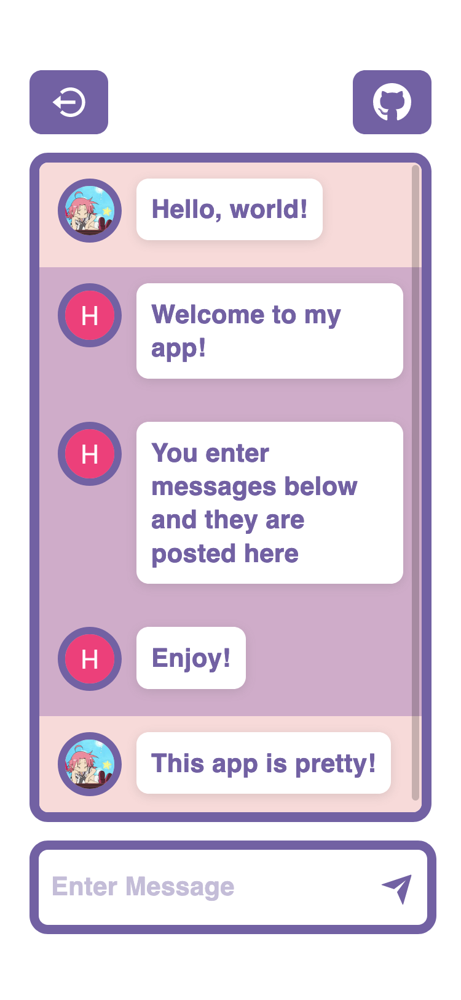

# ChatBoard - A React & Firebase Chat Application

## Table of contents

- [Overview](#overview)
  - [Screenshot](#screenshot)
  - [Links](#links)
- [My process](#my-process)
  - [Built with](#built-with)

## Overview

Users should be able to:

- Login using Google authentication, provided by Firebase
- Type & view messages sent in chat
- View & use app on devices of all screen-sizes

### Screenshot

 

### Links

- Solution URL: [https://github.com/hebree123/chat-app-react](https://github.com/hebree123/chat-app-react)
- Live Site URL: [https://chat-react-12554.firebaseapp.com/](https://chat-react-12554.firebaseapp.com/)

## My process

- Used React to create component structure
- Integrated Firestore database to catch and store messages sent in chat
- Created custom user interface design, using Material UI as a foundation

### Built with

- React.js
- Firebase
- Material UI
- ESLint
- Prettier
- Mobile-first workflow

